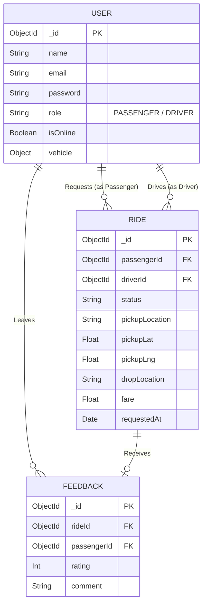

# 🚗 Cult Ride - IIT Roorkee Campus Ride-Sharing

## 📖 Project Overview
Cult Ride is a full-stack, real-time ride-sharing application designed exclusively for the IIT Roorkee campus. It connects passengers (students, faculty, staff) with campus drivers instantly, providing live location tracking, fare estimation, and seamless ride management.

## 🚀 Live Deployment
> **Deployed Link:** [(https://cult-project-dev.vercel.app)]
> **Youtube Video Link:** [(https://www.youtube.com/watch?v=DdKTFccKd_s)]
## 🎯 Problem Understanding
The IIT Roorkee campus is vast, and navigating between distant departments, hostels (Bhawans), and gates often requires a dedicated intra-campus commute system. Traditional e-rickshaws lack a unified, real-time booking platform. Cult Ride solves this by providing a reliable, digital dispatch and ride-hailing system tailor-made for IIT Roorkee's geography, ensuring quicker matching of drivers and passengers, upfront fare estimation, and real-time tracking.

## ✨ Feature List
### For Passengers
- **Campus-Specific Locations:** Pre-configured with over 80+ prominent IIT Roorkee locations.
- **Real-Time Booking:** Request a ride instantly or schedule one for later.
- **Live Tracking:** Watch your driver approach on an interactive map.
- **Fare Estimation:** Get upfront fare calculations based on campus distances.
- **Ride History & Feedback:** View past trips and rate drivers.

### For Drivers
- **Interactive Dashboard:** Toggle online/offline status to start receiving pings.
- **Real-Time Radar:** Instantly see new ride requests with pickup/dropoff points and fare.
- **Live Navigation:** Built-in routing and live GPS updates.
- **Earnings & Analytics:** Track total rides, lifetime earnings, and average rating.

## 🏗️ System Architecture
Cult Ride employs a decoupled Client-Server architecture:
- **Frontend (Client):** Built with Next.js and React. Handles UI rendering, global state (Zustand), and live map rendering (Leaflet). It maintains a persistent WebSocket connection to the backend.
- **Backend (Server):** An Express.js REST API that handles authentication and serves as a WebSocket server (Socket.io) for real-time bidirectional communication.
- **Database:** MongoDB handles persistent storage for users, ride histories, and feedback.
- **Real-Time Layer:** Socket.io manages driver availability ("online_drivers" room), ride dispatch pings, and live geolocation updates.

## 🗄️ Database Schema
The system uses MongoDB (Mongoose) with three primary collections:
- **User:** Stores `email`, `password` (hashed), `name`, `role` (`PASSENGER` or `DRIVER`), `phone`, `isOnline` status, and embedded `vehicle` details for drivers.
- **Ride:** Stores `passengerId`, `driverId`, `status` (`REQUESTED`, `ACCEPTED`, `IN_PROGRESS`, `COMPLETED`, `CANCELLED`, `SCHEDULED`), `pickup/drop` locations and coordinates, `fare`, and timestamps.
- **Feedback:** Stores `rideId`, `passengerId`, `rating` (1-5), and optional `comment`.

## 📊 Entity Relationship Diagram (ERD)



## 🔌 API Overview
The application uses a hybrid of REST endpoints and WebSocket events:

**REST API (Authentication)**
- `POST /api/auth/register` - Register a new user (Passenger/Driver).
- `POST /api/auth/login` - Authenticate and receive a JWT.

**WebSocket Events (Socket.io)**
- **Connection/Auth:** `connect`, `disconnect`, `initial_drivers_state`
- **Driver Status:** `driver_go_online`, `driver_go_offline`, `driver_status_change`
- **Ride Lifecycle:** `request_ride`, `new_ride_request`, `accept_ride`, `ride_accepted`, `complete_ride`, `ride_completed`, `cancel_ride`
- **Live Location:** `all_driver_locations`

## 🧠 Design Decisions
- **WebSocket over Polling:** To ensure the driver radar and passenger live tracking are instantaneous, Socket.io is used instead of HTTP polling, reducing server load and latency.
- **Haversine Distance Formula:** Because Leaflet routing is entirely client-side, the backend uses pure mathematical Haversine formulas to estimate distance and calculate fares instantly upon request without relying on external paid map APIs.
- **Zustand for State Management:** Chosen over Redux for its lightweight, boilerplate-free architecture, making it perfect for managing complex socket state updates.
- **Pre-defined Campus Nodes:** IIT Roorkee locations are hardcoded as a dictionary. This restricts the map to campus boundaries and simplifies the user input experience via autosuggestion instead of free-text geocoding.

## 🛠️ Technology Stack
- **Frontend:** Next.js 16 (React 19), Tailwind CSS v4, Zustand, React-Leaflet, Socket.io-client.
- **Backend:** Node.js, Express.js, Socket.io, JWT, bcryptjs.
- **Database:** MongoDB (Mongoose).

## 📦 Setup Instructions

### Prerequisites
- Node.js (v20+)
- MongoDB connection string (Atlas or Local)

### 1. Backend Setup
```bash
cd backend
npm install
```
Create a `.env` file in the `backend` folder:
```env
PORT=5001
JWT_SECRET="your_secret_key"
FRONTEND_URL="http://localhost:3000"
MONGO_URI="mongodb+srv://<username>:<password>@cluster.mongodb.net/your_database"
```

### 2. Frontend Setup
```bash
cd frontend
npm install
```
Create a `.env.local` file in the `frontend` folder (Optional, defaults below):
```env
NEXT_PUBLIC_API_URL="http://localhost:5001/api"
NEXT_PUBLIC_SOCKET_URL="http://localhost:5001"
```

## 🏃 Running the Application
To run both ends locally:
1. **Start Backend:** `cd backend && npm run dev`
2. **Start Frontend:** `cd frontend && npm run dev`
3. Open [http://localhost:3000](http://localhost:3000) in your browser.
