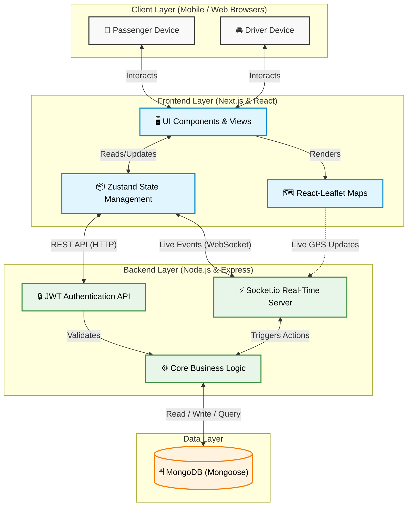

# Cult Ride - System Architecture Diagram

You can view this diagram directly on GitHub, which will automatically render it into a beautiful graphic that you can screenshot for your presentation!

```mermaid
graph TD
    %% Define Styles
    classDef client fill:#f9f9f9,stroke:#333,stroke-width:2px,color:#333;
    classDef frontend fill:#e1f5fe,stroke:#0288d1,stroke-width:2px,color:#000;
    classDef backend fill:#e8f5e9,stroke:#388e3c,stroke-width:2px,color:#000;
    classDef database fill:#fff3e0,stroke:#f57c00,stroke-width:2px,color:#000;

    %% Client Layer
    subgraph Clients["Client Layer (Mobile / Web Browsers)"]
        P["👤 Passenger Device"]:::client
        D["🚘 Driver Device"]:::client
    end

    %% Frontend Layer
    subgraph Frontend["Frontend Layer (Next.js & React)"]
        UI["🖥️ UI Components & Views"]:::frontend
        State["📦 Zustand State Management"]:::frontend
        Maps["🗺️ React-Leaflet Maps"]:::frontend
    end

    %% Backend Layer
    subgraph Backend["Backend Layer (Node.js & Express)"]
        Auth["🔒 JWT Authentication API"]:::backend
        Socket["⚡ Socket.io Real-Time Server"]:::backend
        Controllers["⚙️ Core Business Logic"]:::backend
    end

    %% Database Layer
    subgraph Database["Data Layer"]
        Mongo[("🗄️ MongoDB (Mongoose)")]:::database
    end

    %% Connections
    P <-->|"Interacts"| UI
    D <-->|"Interacts"| UI

    UI <-->|"Reads/Updates"| State
    UI -->|"Renders"| Maps

    State <-->|"REST API (HTTP)"| Auth
    State <-->|"Live Events (WebSocket)"| Socket
    Maps -.->|"Live GPS Updates"| Socket

    Auth -->|"Validates"| Controllers
    Socket <-->|"Triggers Actions"| Controllers

    Controllers <-->|"Read / Write / Query"| Mongo
```
